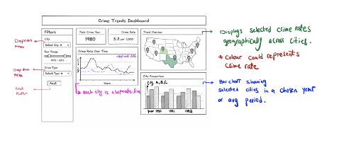

## Section 1: Motivation and Purpose

> **Our role:** Data scientist consultancy firm
> **Target audience:** Public safety policy analysts and city-level decision makers (e.g., municipal public safety departments)
>
> Historical crime data contains decades of valuable information, but it is often stored in raw tabular formats that are difficult to interpret and compare. The city-level UCR dataset (1975–2015) published by The Marshall Project provides long-term crime statistics across major U.S. cities, yet extracting meaningful trends from a CSV file requires significant manual effort.
>
> Public safety analysts need to understand how violent and property crime have changed over time, identify peak periods, and compare patterns across cities. Without interactive tools, this process is slow, fragmented, and prone to oversimplification.
>
> To address this challenge, we propose building an interactive crime trends dashboard that allows policy analysts to visually explore long-term crime data. Our app will display trends over time, allow filtering by city and year range, and enable comparisons between crime categories and across multiple cities. By transforming raw data into clear visualizations, the dashboard will help decision makers identify patterns, detect anomalies, and generate evidence-based insights to inform public safety strategies.

## Section 2: Description of the Data 

## Section 3: Research Questions & Usage Scenarios

### Persona
> Name: Jordan Ramirez
> Role: Public Safety Policy Analyst
> Organization: The Marshall Project (our data source reference)
> Experience Level: Mid-career analyst (say 5–7 years in criminal justice policy)
> Goals:
> - Identify long-term crime trends across U.S. cities
> - Detect structural shifts (e.g., post-1990s decline, 2008 recession era, post-2010 fluctuations)
> - Support data-driven policy recommendations
> Technical Skills:
> - Comfortable with dashboards and filtering tools
> - Familiar with UCR definitions (violent crime, property crime)
> - Limited coding ability and mostly relies on visual analytics tools
> Pain Points:
> - Raw CSV datasets are difficult to interpret quickly
> - Hard to compare cities consistently over long time spans
> - Needs evidence-based insights rather than isolated statistics

### Usage Scenario Narrative
> Jordan is a public safety policy analyst reviewing long-term crime trends using historical UCR data (1975–2015) from major U.S. cities. He wants to understand how violent and property crime rates have changed over time and whether patterns differ significantly between cities.

> When Jordan logs into the Crime Trends Dashboard, he sees:
> - An overview panel showing total crime counts by year
> - Filters for city, year range, and crime type (violent vs property crime categories from the dataset)
> - Line charts displaying trends from 1975 to 2015
> - Comparative views allowing side-by-side city analysis
> Jordan begins by selecting a single city to examine its long-term trajectory. He then adjusts the year slider to focus on specific decades (e.g., 1980s peak crime years vs post-2000 declines).

> Next, he compares two cities to see whether crime declines occurred simultaneously or at different times. He may observe that while most cities show a general decline in violent crime after the early 1990s, the magnitude and timing vary significantly.
> Using the dashboard, Jordan identifies:
> - Years with peak violent crime
> - Periods of sustained decline
> - Differences between violent and property crime trends
> - Cities that deviate from national patterns
> Based on these findings, Jordan can form hypotheses about contributing factors (e.g., policy reforms, economic shifts, demographic changes) and propose further investigation. The dashboard does not explain causation but helps him detect patterns worth deeper study.

### User Stories
> User Story 1
> As a public safety policy analyst, I want to filter crime data by city and year range so that I can analyze long-term trends within a specific location.

> User Story 2
> As a policy analyst, I want to compare violent and property crime trends so that I can understand whether different crime categories follow similar or divergent patterns over time.

> User Story 3
> As a policy analyst, I want to compare multiple cities side-by-side so that I can identify which cities experienced larger increases or decreases in crime during specific periods.

> User Story 4
> As a policy analyst, I want to identify peak crime years for each city so that I can contextualize policy changes and major interventions around those time periods.

## Section 4: Exploratory Data Analysis 

## Section 5: App Sketch & Description

The Crime Trends Dashboard follows a structured two-column layout designed to support interactive exploration of long-term UCR crime data from 1975–2015. The interface consists of a header, a left-side filter panel, summary statistic cards, and three primary visual components: a time-series chart, a geographic map, and a city comparison bar chart. The layout is designed to guide users from high-level summaries to detailed comparative analysis.

At the top of the dashboard, a header clearly identifies the scope of the analysis, indicating that the application focuses on historical crime trends across major U.S. cities. This provides contextual framing for the data being explored.

The left sidebar contains the primary interactive controls. Users can select one or multiple cities using a multi-select dropdown, adjust the year range using a slider spanning 1975 to 2015, and choose the crime category (e.g., violent crime or property crime) from a dropdown menu. A reset button allows users to quickly return to the default state of the dashboard. These filters update all visual components dynamically, enabling customized analysis of specific cities, time periods, and crime categories.

The top of the main content area contains summary statistic cards. These include the peak crime year within the selected time range and the current crime rate for the selected city or cities. These metrics provide immediate high-level insights before deeper analysis. The peak year indicator directly supports the identification of significant crime periods, while the displayed crime rate contextualizes the magnitude of the selected metric.

The primary visualization is a time-series line chart showing crime rates over time. The x-axis represents year, and the y-axis represents the selected crime rate (preferably per 100,000 population). When multiple cities are selected, each city is represented by a separate line, enabling direct comparison of long-term trends. This visualization supports analysis of sustained increases, declines, and timing differences across cities and crime categories.

A geographic map component displays selected cities across the United States. Color intensity represents the magnitude of crime rates, allowing users to quickly identify geographic patterns or regional clustering. The map updates based on selected filters and complements the time-series analysis by adding spatial context.

Finally, a bar chart provides side-by-side comparison of cities within a selected year or averaged over the chosen time range. This component allows users to compare magnitudes directly and identify which cities experienced larger increases or decreases during specific periods.

All components are interconnected. Adjusting filters dynamically updates summary statistics, the line chart, the map, and the comparison chart simultaneously. This coordinated interaction ensures that users can seamlessly move between temporal, geographic, and comparative perspectives while maintaining analytical consistency.

